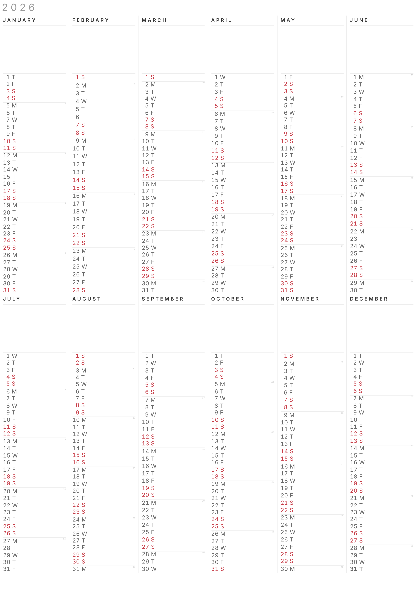
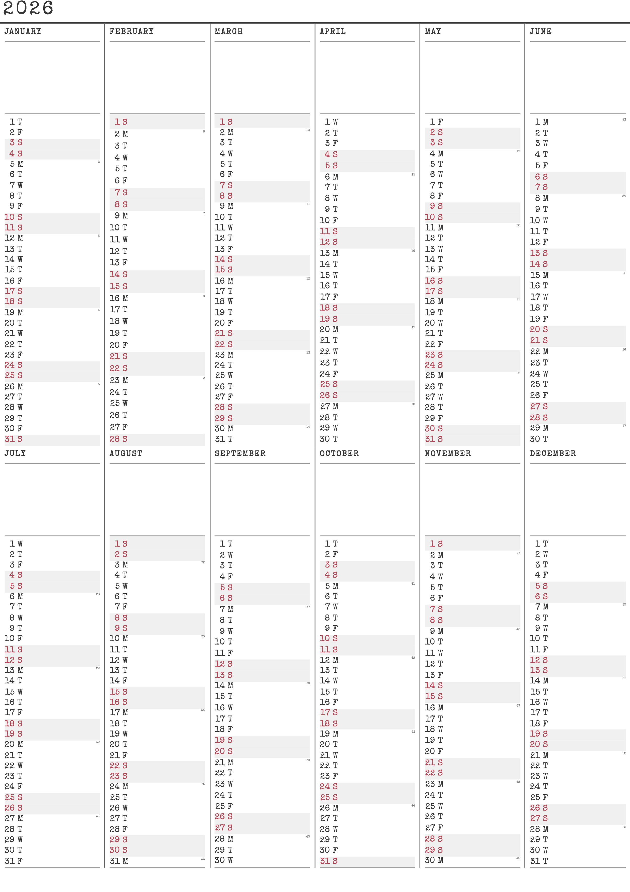
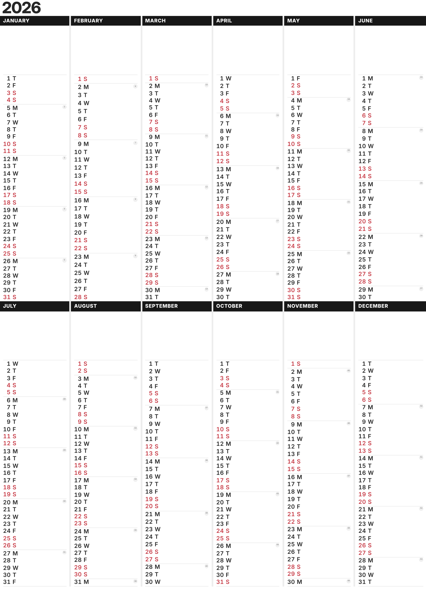

# ycal

Tool for generating printable yearly calendars.

⚠️ The code in this repo was written using Claude Code (with human oversight) ⚠️

## Themes

ycal has three built-in themes:

- **minimalist** — Clean sans-serif design with minimal decoration



- **retro** — Typewriter-style monospace font with a vintage feel



- **contemporary** — Modern sans-serif with bolder visual accents



## Usage

ycal can be used in two ways: through a web UI and from the terminal using a CLI.

### Web UI

To use the web UI, run:

```bash
just serve
```

This starts a local web server and automatically opens the web UI in your default browser.

### CLI

The CLI can be used to generate a self-contained HTML file that can be manually printed.

```
$ just gen --help

Generate a printable yearly calendar as HTML

Usage: cli [OPTIONS] --theme <THEME> <YEAR>

Arguments:
  <YEAR>  Year to generate calendar for (1-9999)

Options:
      --locale <LOCALE>
          Locale code (e.g. en-GB, sv-SE, de-DE) [default: en-GB]
      --day-name-characters <DAY_NAME_CHARACTERS>
          Number of characters to use for day names [default: 1]
      --special-days <SPECIAL_DAYS>
          Path to JSON special days file
      --theme <THEME>
          Path to CSS theme file
  -h, --help
          Print help
```

Examples:

```bash
# Default settings
just gen 2026 > calendar.html

# Swedish calendar with retro theme, special days and using three characters for day names
just gen 2026 --locale sv-SE --day-name-characters 3 --special-days swedish_holidays_2026.json --theme themes/retro.css > calendar.html
```

#### Special days

The `--special-days` option expects the file to have the following format:

```json
[
  { "date": "2026-07-07", "name": "Dad's birthday", "is_holiday": false },
  { "date": "2026-12-24", "name": "Christmas", "is_holiday": true }
]
```

Days with `"is_holiday": true` are styled in red like weekends, while `false` displays the name without any color change.

You can generate a special days file with public holidays using the bundled `holidays` script, which fetches the [Nager.Date API](https://date.nager.at/):

```bash
just holidays 2026 GB > holidays.json
just gen 2026 --locale en-GB --theme themes/minimalist.css --special-days holidays.json > calendar.html
```

You can also easily use Claude Code to generate a special days file with public holidays from an arbitrary website. For example, to create one with England's bank holidays:

```
claude -p "Fetch https://www.gov.uk/bank-holidays and extract the England bank holidays for 2026. Output a JSON array where each entry has \"date\" (YYYY-MM-DD), \"name\", and \"is_holiday\": true. Output only the JSON." > bank-holidays.json
```

## Architecture

The main logic for generating the calendar lives in the `src/html_gen.rs` library. This library uses [chrono](https://crates.io/crates/chrono) to generate calendar data and renders it using [ramhorns](https://crates.io/crates/ramhorns) into a self-contained HTML string.

Two frontends use this shared library:

- **CLI** (`src/cli.rs`) — Parses command-line arguments and writes the library output to stdout.
- **Web UI** (`static/` + `src/wasm.rs`) — A static web page that uses a WASM build of the library. The web UI fetches public holidays directly from the [Nager.Date API](https://date.nager.at/).

Theming is provided using separate CSS files. The theme CSS is embedded directly into the generated HTML, making the output fully self-contained.

## Development

```bash
# Web UI. Builds the code, and starts a live-reloading web server that hosts the files.
just dev-web

# CLI. This uses the CLI to generate HTML files for all themes in the out/ folder, and starts a live-reloading web server that hosts the files.
just dev-cli
```
